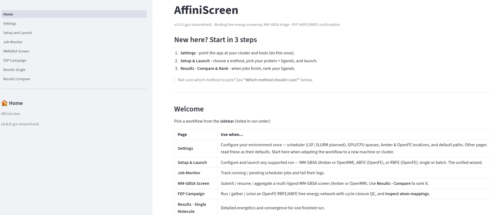
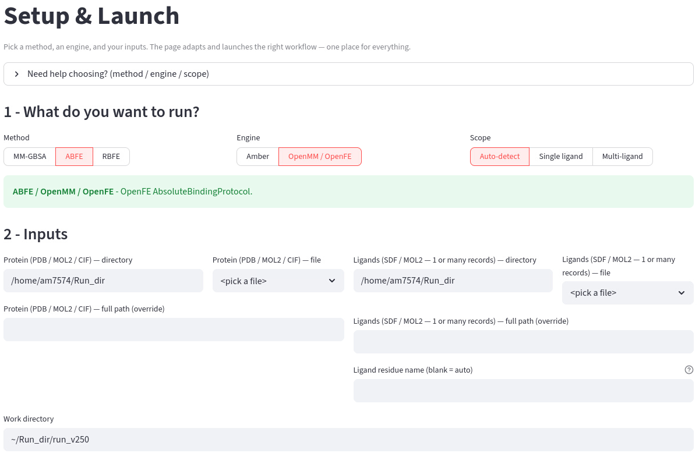
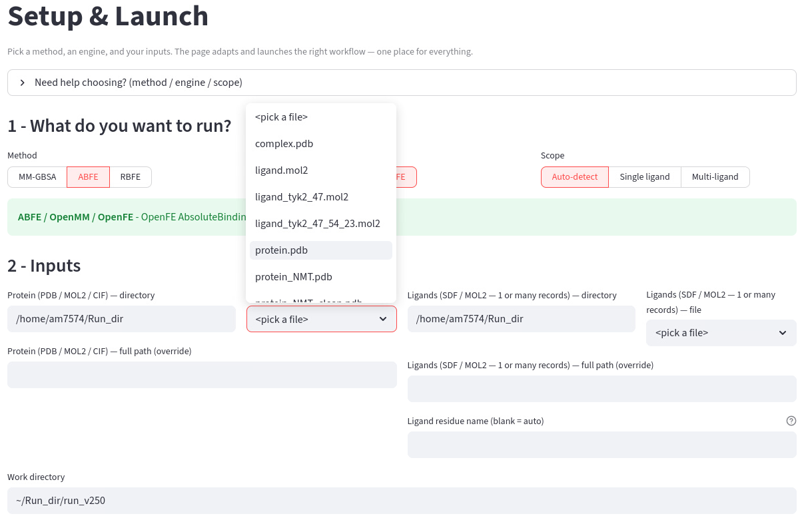
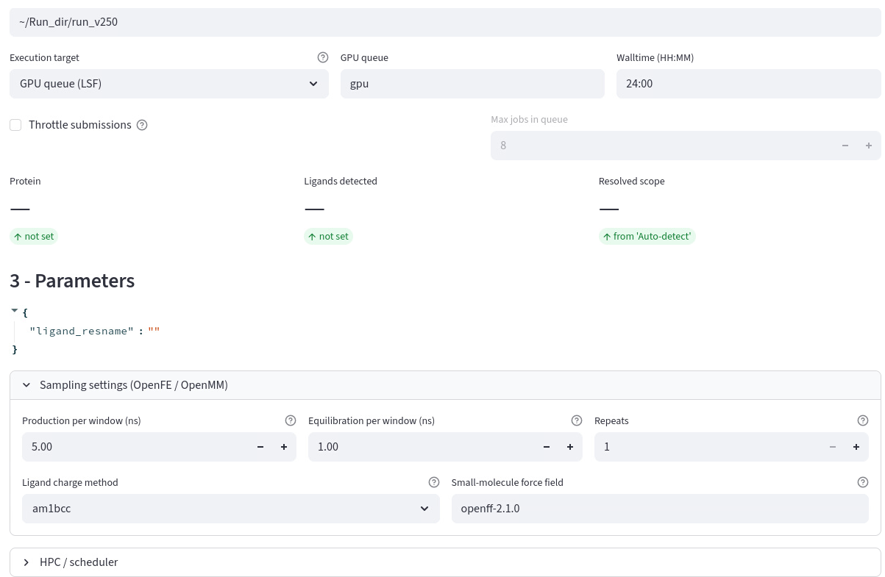
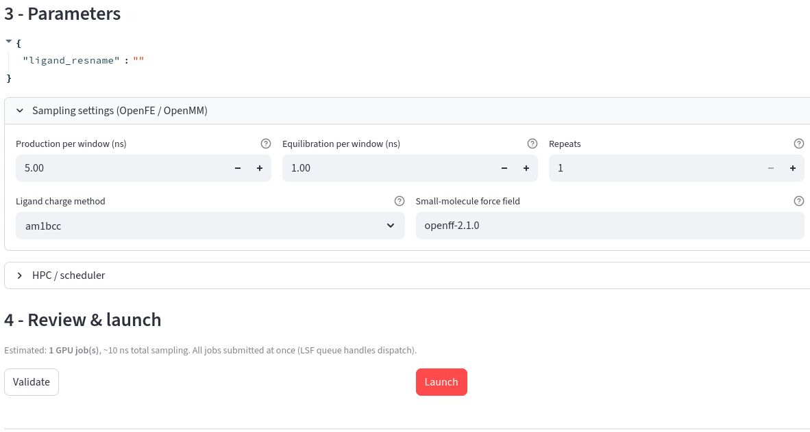
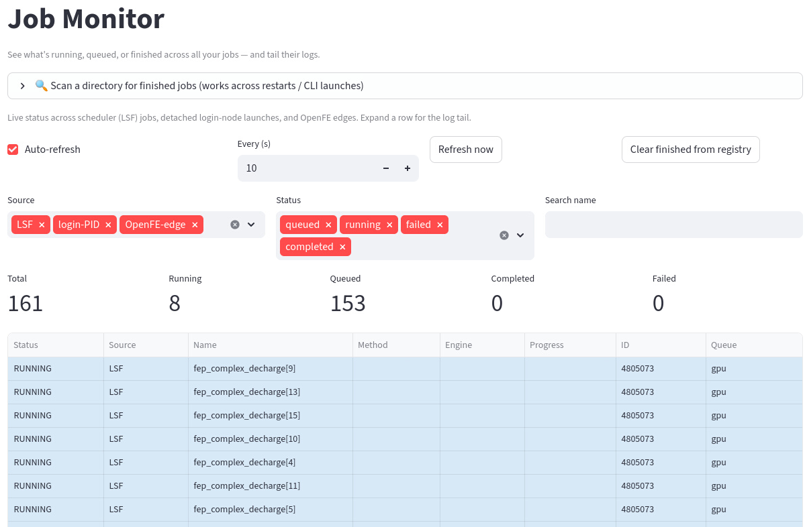
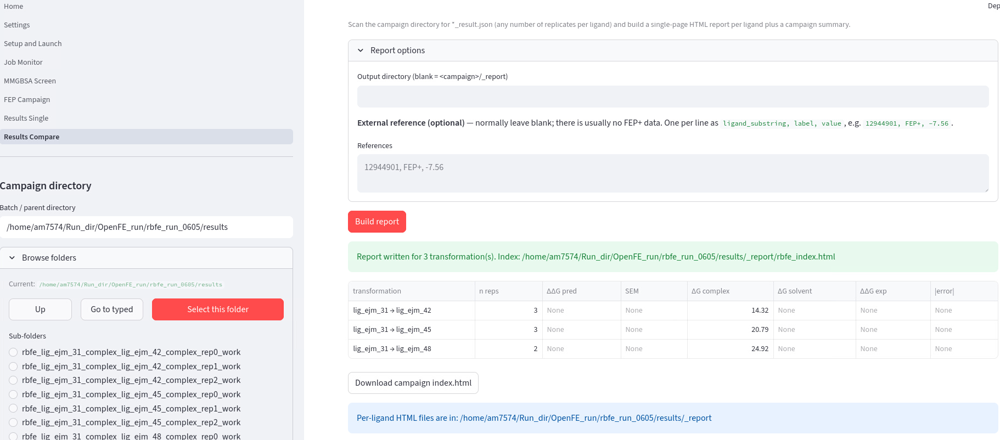
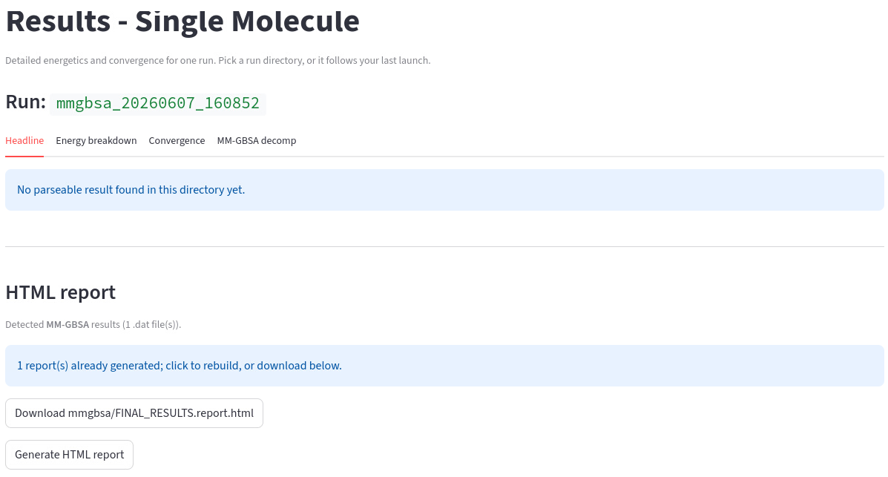

# User Manual — AffiniScreen

This manual walks through the Streamlit GUI page by page. Screenshots are
referenced from `docs/images/`; replace the placeholder files with real
captures from your deployment (filenames are already wired below).

> **Supported workflows.** The GUI exposes **MM-GBSA** (Amber or OpenMM),
> **ABFE** (OpenFE), and **RBFE** (OpenFE). Amber ABFE/RBFE are intentionally
> not available in the GUI — use the `amber-fep-driver` CLI for those.

---

## Start in 3 steps

1. **Settings** — point the app at your cluster and tools (do this once).
2. **Setup & Launch** — choose a method, pick your protein + ligands, and launch.
3. **Results — Compare & Rank** — when jobs finish, rank your ligands.

## Which method should I use?

| If you want to... | Use | Speed | Accuracy |
|---|---|---|---|
| Quickly triage many ligands against one target | **MM-GBSA** | Fast | Approximate (ranking) |
| Get an absolute binding free energy for each ligand | **ABFE** | Slow | High |
| Precisely rank a series of similar ligands | **RBFE** | Slow | High (relative) |

- **MM-GBSA** is the cheap first pass — run it on your whole library, then
  promote the top hits to a rigorous free-energy method.
- **RBFE** shines when your ligands are chemically similar (a congeneric
  series); it computes the *difference* between pairs, which cancels errors.
- **ABFE** gives a standalone number per ligand — use it for diverse ligands or
  when you need an absolute value, not just a ranking.

---

## 0. Launching

```bash
./run_gui.sh            # or: streamlit run amber_md/gui/Home.py
```

Open the printed URL (default `http://localhost:8501`). The **Home** page shows
the version badge and a table of supported workflows.



---

## 1. Setup & Launch

This is the unified wizard. Work top to bottom.

### 1.1 Choose what to run
Pick **Method** (MM-GBSA / ABFE / RBFE), **Engine** (Amber / OpenMM · OpenFE),
and **Scope** (Auto-detect / Single / Multi-ligand). A compatibility banner
confirms whether the combination is supported.



Supported combinations:

| Method | Amber | OpenMM / OpenFE |
|--------|:-----:|:---------------:|
| MM-GBSA | ✅ | ✅ (experimental) |
| ABFE | ❌ (GUI) | ✅ |
| RBFE | ❌ (GUI) | ✅ |

If you pick a disabled combination (e.g. **ABFE / Amber**) the page shows a
red banner and suggests the supported engine.

### 1.2 Inputs
Select a **protein** (PDB/MOL2/CIF) and a **ligands** file (SDF/MOL2, one or
many records). The page auto-detects the ligand count and (for MOL2) the
residue name.



### 1.3 Parameters
A method-specific panel appears:
- **MM-GBSA** — GB model, salt, frame window/stride, MD production/equilibration
  time, optional per-residue decomposition.
- **ABFE / RBFE (OpenFE)** — per-window sampling time, repeats, charge method,
  small-molecule force field, and (RBFE) atom mapper + network type.



### 1.4 Execution target & review
Choose **GPU queue (LSF)** or **Local host**, optionally throttle submissions,
review the compute estimate, then **Validate** and **Launch**. The exact shell
command(s) are printed for transparency.



---

## 2. Job Monitor

Tracks your LSF jobs (PEND/RUN), enriches Amber MD rows with `prod.out`
progress, and tails logs.



---

## 3. MM-GBSA Screen

Manage a multi-ligand MM-GBSA batch: **Submit** (Amber), **Resume / status**,
and **Aggregate + rank** (both engines). OpenMM screens are submitted from
Setup & Launch and aggregated here.


---

## 4. FEP Campaign (OpenFE)

Drives an OpenFE RBFE/ABFE campaign end to end. Tabs:
- **Atom mapping** — network diagnostics, edge table, perturbation graph,
  per-edge MCS SMARTS/masks.
- **Run edges** — submit one bsub per (edge × replicate), with optional
  throttling.
- **Status** — live progress buckets.
- **Gather & solve** — run `openfe gather`, solve the network to per-ligand
  ΔG, and check cycle-closure residuals.
- **Preview script** — the exact command that will run.



---

## 5. Results — Single Molecule

Detailed energetics and convergence for one finished run (MM-GBSA or FEP),
with a one-click report.



---

## 6. Results — Compare & Rank

The universal ranker. Auto-detects MM-GBSA and OpenFE ABFE per-ligand outputs
across a campaign, solves a detected RBFE network inline, ranks ligands,
plots predicted vs experimental values, and exports CSV. A workflow-routing
help table explains which page to use for each Method × Engine × count.


---

## Troubleshooting

| Symptom | Likely cause | Fix |
|---------|--------------|-----|
| "ABFE / Amber is not available" | Amber ABFE/RBFE are GUI-disabled | Use the OpenFE engine, or the `amber-fep-driver` CLI. |
| Version badge differs from expected | A stale `amber_md` is imported | `pip install -e .` into the env the GUI runs in. |
| OpenFE launch preflight fails | AmberTools/OpenMM missing in the OpenFE env | Follow the preflight message (usually `conda install -c conda-forge ambertools openmm`). |

See [`INSTALL.md`](INSTALL.md) for environment details.
